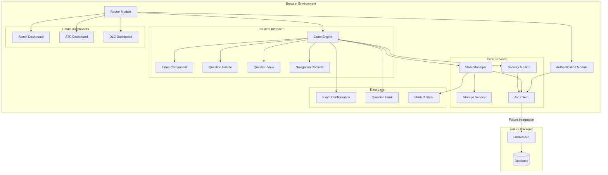
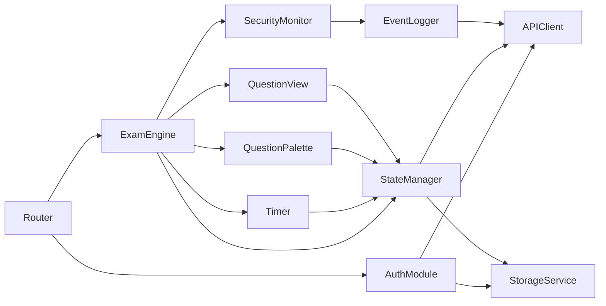
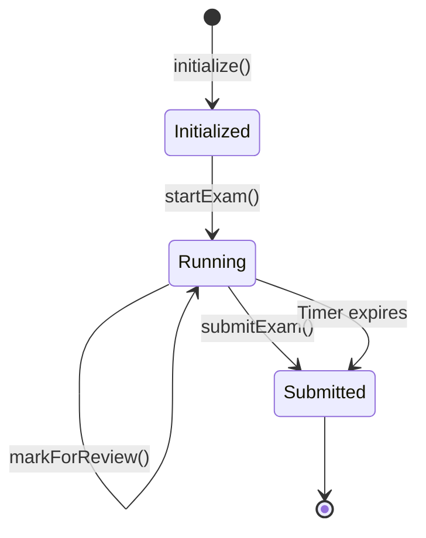

# Design Document: Online Examination Portal

## Overview

The Online Examination Portal is a high-performance, framework-free web application designed to deliver secure examinations to 1000+ concurrent students. Built with HTML5, Tailwind CSS, and Vanilla JavaScript (ES6+), the system prioritizes performance, maintainability, and seamless future integration with a Laravel backend.

### Design Philosophy

The architecture follows these core principles:

1. **Framework-Free Simplicity**: No React, Angular, or Vue dependencies - pure ES6+ modules for maximum control and minimal overhead
2. **API-Ready Architecture**: Clean separation between frontend logic and future backend integration points
3. **Performance-First**: Sub-100ms question transitions, atomic state updates, and optimized DOM operations
4. **Extensibility**: Modular design supporting future Admin, ATC, and DLC dashboards without restructuring
5. **Security by Design**: Configurable proctoring, event logging, and full-screen enforcement

### Key Capabilities

- Concurrent support for 1000+ students with deterministic state management
- Question and option randomization with backend-compatible seeding
- Real-time timer with automatic submission
- Comprehensive question palette with visual status indicators
- Tab switch and full-screen exit detection
- Role-based routing architecture for multi-dashboard support
- Responsive design optimized for desktop and tablet (1366x768+)

## Architecture

### High-Level System Architecture



### Architectural Layers

#### 1. Routing Layer
- **Purpose**: URL-based navigation without page reloads
- **Technology**: History API with custom router implementation
- **Routes**: `/login`, `/student`, `/admin`, `/atc`, `/dlc`
- **Extensibility**: New routes added via configuration, no code restructuring

#### 2. Authentication Layer
- **Purpose**: Credential validation and session management
- **Current**: Client-side validation with localStorage
- **Future**: JWT-based authentication via Laravel API
- **Integration Point**: `APIClient.authenticate(credentials)`

#### 3. Presentation Layer
- **Purpose**: UI rendering and user interaction
- **Components**: Modular, reusable UI components
- **Styling**: Tailwind CSS utility classes
- **State Binding**: Manual DOM updates via state observers

#### 4. Business Logic Layer
- **Purpose**: Exam execution, timing, and state management
- **Core Module**: Exam Engine
- **State Management**: Centralized StateManager with atomic updates
- **Security**: SecurityMonitor for proctoring enforcement

#### 5. Data Layer
- **Purpose**: Data parsing, validation, and serialization
- **Current**: LocalStorage for persistence
- **Future**: RESTful API communication via APIClient
- **Formats**: JSON for all data interchange

### Module Dependency Graph



### Concurrency and Performance Strategy

To support 1000+ concurrent students:

1. **Stateless Frontend**: Each student session is independent
2. **Atomic State Updates**: Single-threaded JavaScript with synchronous state mutations
3. **Minimal DOM Operations**: Virtual state with batched DOM updates
4. **Efficient Event Handling**: Event delegation for palette and navigation
5. **Lazy Loading**: Questions loaded on-demand, not all at once
6. **Memory Management**: Cleanup of event listeners and timers on navigation

## Components and Interfaces

### 1. Router Module

**Responsibility**: Client-side routing with History API

**Interface**:
```javascript
class Router {
  /**
   * Register a route handler
   * @param {string} path - Route path (e.g., '/student')
   * @param {Function} handler - Route handler function
   */
  register(path, handler)
  
  /**
   * Navigate to a route
   * @param {string} path - Target path
   * @param {Object} state - Optional state object
   */
  navigate(path, state)
  
  /**
   * Get current route
   * @returns {string} Current path
   */
  getCurrentRoute()
}
```

**Implementation Details**:
- Uses `history.pushState()` for navigation
- Listens to `popstate` event for browser back/forward
- Route handlers receive parsed URL parameters
- Supports nested routes via path matching

**Integration Points**:
- Called by authentication module after successful login
- Called by exam engine for navigation between sections
- Future: Called by role-based dashboards

### 2. Authentication Module

**Responsibility**: Credential validation and session management

**Interface**:
```javascript
class AuthenticationModule {
  /**
   * Authenticate user credentials
   * @param {Object} credentials - User credentials
   * @param {string} credentials.identifier - Student ID or username
   * @param {string} credentials.centerName - Exam center name
   * @param {string} credentials.examSlot - Exam slot identifier
   * @param {string} credentials.timeWindow - Time window identifier
   * @returns {Promise<AuthResult>} Authentication result
   */
  async authenticate(credentials)
  
  /**
   * Check if user is authenticated
   * @returns {boolean} Authentication status
   */
  isAuthenticated()
  
  /**
   * Get current user session
   * @returns {Object|null} User session data
   */
  getCurrentSession()
  
  /**
   * Logout current user
   */
  logout()
}
```

**Current Implementation**:
- Validates credentials against mock data structure
- Stores session in localStorage
- Session includes: studentId, role, examAccess

**Future Integration**:
```javascript
// API endpoint: POST /api/auth/login
{
  identifier: "STUDENT123",
  centerName: "Center A",
  examSlot: "SLOT1",
  timeWindow: "MORNING"
}

// Response:
{
  token: "jwt_token_here",
  user: {
    id: "uuid",
    role: "student",
    name: "Student Name",
    examAccess: ["exam_id_1", "exam_id_2"]
  }
}
```

### 3. Exam Engine

**Responsibility**: Core exam execution, timing, and state orchestration

**Interface**:
```javascript
class ExamEngine {
  /**
   * Initialize exam with configuration
   * @param {Object} examConfig - Exam configuration
   * @param {string} examConfig.examId - Unique exam identifier
   * @param {string} examConfig.examType - 'demo' or 'main'
   * @param {number} examConfig.duration - Duration in minutes
   * @param {number} examConfig.questionCount - Number of questions to select
   * @param {Object} examConfig.security - Security configuration
   * @param {number} examConfig.randomSeed - Seed for deterministic randomization
   */
  initialize(examConfig)
  
  /**
   * Start exam execution
   * @returns {Promise<void>}
   */
  async startExam()
  
  /**
   * Navigate to specific question
   * @param {number} questionIndex - Zero-based question index
   */
  navigateToQuestion(questionIndex)
  
  /**
   * Submit answer for current question
   * @param {string|string[]} answer - Answer value(s)
   */
  submitAnswer(answer)
  
  /**
   * Mark current question for review
   */
  markForReview()
  
  /**
   * Submit entire exam
   * @returns {Promise<SubmissionResult>}
   */
  async submitExam()
  
  /**
   * Get current exam state
   * @returns {Object} Current state snapshot
   */
  getState()
}
```

**State Machine**:


**Implementation Details**:
- Manages Timer, QuestionPalette, and QuestionView lifecycle
- Delegates state updates to StateManager
- Enforces security rules via SecurityMonitor
- Handles automatic submission on timer expiry

### 4. State Manager

**Responsibility**: Centralized state management with atomic updates

**Interface**:
```javascript
class StateManager {
  /**
   * Initialize state with exam data
   * @param {Object} initialState - Initial state object
   */
  initialize(initialState)
  
  /**
   * Update state atomically
   * @param {Function} updater - State update function
   */
  update(updater)
  
  /**
   * Get current state snapshot
   * @returns {Object} Immutable state copy
   */
  getState()
  
  /**
   * Subscribe to state changes
   * @param {Function} listener - Change listener
   * @returns {Function} Unsubscribe function
   */
  subscribe(listener)
  
  /**
   * Persist state to storage
   */
  persist()
  
  /**
   * Restore state from storage
   * @param {string} examId - Exam identifier
   * @returns {Object|null} Restored state
   */
  restore(examId)
}
```

**State Structure**:
```javascript
{
  examId: "exam_uuid",
  examType: "main", // or "demo"
  studentId: "student_uuid",
  startTime: 1234567890,
  duration: 60, // minutes
  currentQuestionIndex: 0,
  questions: [
    {
      id: "q1",
      originalIndex: 42, // Original position in question bank
      type: "multiple-choice",
      text: "Question text",
      options: ["A", "B", "C", "D"], // Randomized order
      correctAnswer: "B", // Not exposed to frontend in production
      answer: null, // Student's answer
      markedForReview: false,
      attemptedAt: null
    }
  ],
  security: {
    fullScreenRequired: true,
    cameraRequired: false,
    microphoneRequired: false,
    tabSwitchCount: 0,
    fullScreenExitCount: 0,
    events: []
  },
  submitted: false,
  submittedAt: null
}
```

**Performance Optimizations**:
- State updates are synchronous (no async state mutations)
- Listeners notified in batch after update completes
- Deep cloning avoided via structural sharing where possible
- Persistence throttled to every 5 seconds or on critical events

### 5. Timer Component

**Responsibility**: Countdown timer with automatic submission

**Interface**:
```javascript
class Timer {
  /**
   * Start timer with duration
   * @param {number} durationMinutes - Duration in minutes
   * @param {Function} onExpire - Callback when timer expires
   */
  start(durationMinutes, onExpire)
  
  /**
   * Pause timer
   */
  pause()
  
  /**
   * Resume timer
   */
  resume()
  
  /**
   * Get remaining time
   * @returns {number} Remaining seconds
   */
  getRemainingTime()
  
  /**
   * Stop and cleanup timer
   */
  stop()
}
```

**Implementation Details**:
- Uses `setInterval` with 1-second precision
- Displays MM:SS format
- Visual warnings at 5 minutes and 1 minute remaining
- Automatically calls `onExpire` callback when time reaches zero
- Persists remaining time to state every second

**UI Behavior**:
- Always visible (sticky positioning)
- Color changes: green → yellow (5 min) → red (1 min)
- Pulsing animation when < 1 minute

### 6. Question Palette Component

**Responsibility**: Visual navigation and status display for all questions

**Interface**:
```javascript
class QuestionPalette {
  /**
   * Initialize palette with question count
   * @param {number} questionCount - Total questions
   * @param {Function} onQuestionClick - Click handler
   */
  initialize(questionCount, onQuestionClick)
  
  /**
   * Update question status
   * @param {number} questionIndex - Question index
   * @param {string} status - 'unattempted' | 'attempted' | 'marked' | 'current'
   */
  updateQuestionStatus(questionIndex, status)
  
  /**
   * Render palette to DOM
   * @param {HTMLElement} container - Container element
   */
  render(container)
}
```

**Status Indicators**:
- **Unattempted**: White background, gray border
- **Attempted**: Green background, white text
- **Marked for Review**: Yellow background, dark text
- **Current**: Blue border, bold text

**Implementation Details**:
- Grid layout with responsive columns
- Event delegation for click handling
- Batch DOM updates when multiple statuses change
- Accessible via keyboard navigation (Tab + Enter)

### 7. Question View Component

**Responsibility**: Display current question and capture answers

**Interface**:
```javascript
class QuestionView {
  /**
   * Render question
   * @param {Object} question - Question data
   * @param {number} questionNumber - Display number (1-indexed)
   */
  render(question, questionNumber)
  
  /**
   * Get current answer
   * @returns {string|string[]|null} Current answer value
   */
  getCurrentAnswer()
  
  /**
   * Clear view
   */
  clear()
}
```

**Supported Question Types**:
1. **Multiple Choice (Single)**: Radio buttons
2. **Multiple Choice (Multiple)**: Checkboxes
3. **True/False**: Radio buttons
4. **Future**: Numerical input, text input

**Implementation Details**:
- Sanitizes question text and options (XSS prevention)
- Preserves answer state during navigation
- Smooth transitions between questions (fade in/out)
- Keyboard shortcuts: 1-4 for options A-D

### 8. Security Monitor

**Responsibility**: Proctoring enforcement and event logging

**Interface**:
```javascript
class SecurityMonitor {
  /**
   * Initialize with security configuration
   * @param {Object} securityConfig - Security settings
   */
  initialize(securityConfig)
  
  /**
   * Start monitoring
   */
  startMonitoring()
  
  /**
   * Stop monitoring
   */
  stopMonitoring()
  
  /**
   * Get security events
   * @returns {Array} Security event log
   */
  getEvents()
}
```

**Monitored Events**:
1. **Tab Switch**: `visibilitychange` event
2. **Full-Screen Exit**: `fullscreenchange` event
3. **Window Blur**: `blur` event
4. **Right-Click**: `contextmenu` event (disabled)
5. **Copy/Paste**: `copy`, `paste` events (disabled)

**Event Log Structure**:
```javascript
{
  type: "tab_switch",
  timestamp: 1234567890,
  questionIndex: 5,
  metadata: {
    duration: 3000 // milliseconds away
  }
}
```

**Enforcement Actions**:
- Display warning modal on violation
- Log event to state
- For main exams: Increment violation counter
- Future: Send events to backend in real-time

### 9. API Client

**Responsibility**: HTTP communication with Laravel backend

**Interface**:
```javascript
class APIClient {
  /**
   * Authenticate user
   * @param {Object} credentials - Login credentials
   * @returns {Promise<Object>} Auth response
   */
  async authenticate(credentials)
  
  /**
   * Fetch exam configuration
   * @param {string} examId - Exam identifier
   * @returns {Promise<Object>} Exam configuration
   */
  async getExamConfig(examId)
  
  /**
   * Fetch question bank
   * @param {string} examId - Exam identifier
   * @returns {Promise<Array>} Question array
   */
  async getQuestionBank(examId)
  
  /**
   * Submit exam answers
   * @param {Object} submission - Submission payload
   * @returns {Promise<Object>} Submission result
   */
  async submitExam(submission)
  
  /**
   * Fetch exam history
   * @param {string} studentId - Student identifier
   * @returns {Promise<Array>} Exam history
   */
  async getExamHistory(studentId)
  
  /**
   * Fetch certificates
   * @param {string} studentId - Student identifier
   * @returns {Promise<Array>} Certificate array
   */
  async getCertificates(studentId)
  
  /**
   * Log security event
   * @param {Object} event - Security event
   * @returns {Promise<void>}
   */
  async logSecurityEvent(event)
}
```

**Current Implementation**:
- Returns mock data from local JSON files
- Simulates network delay (100-300ms)
- Error simulation for testing

**Future Implementation**:
- Base URL: `/api/v1`
- Authentication: Bearer token in Authorization header
- Error handling: Standardized error responses
- Retry logic: Exponential backoff for failed requests

### 10. Storage Service

**Responsibility**: LocalStorage abstraction with error handling

**Interface**:
```javascript
class StorageService {
  /**
   * Store data
   * @param {string} key - Storage key
   * @param {*} value - Value to store (will be JSON serialized)
   */
  set(key, value)
  
  /**
   * Retrieve data
   * @param {string} key - Storage key
   * @returns {*} Stored value or null
   */
  get(key)
  
  /**
   * Remove data
   * @param {string} key - Storage key
   */
  remove(key)
  
  /**
   * Clear all data
   */
  clear()
}
```

**Implementation Details**:
- Wraps localStorage with try-catch
- Handles quota exceeded errors
- Automatic JSON serialization/deserialization
- Namespace prefix: `exam_portal_`

## Data Models

### Exam Configuration

```javascript
{
  examId: "uuid",
  examType: "main", // or "demo"
  title: "Final Examination 2024",
  subject: "Mathematics",
  duration: 60, // minutes
  totalQuestions: 40,
  questionBankSize: 100,
  randomSeed: 12345, // For deterministic randomization
  security: {
    fullScreenRequired: true,
    cameraRequired: false,
    microphoneRequired: false,
    tabSwitchLimit: 3, // Max allowed violations
    allowReview: true,
    allowSkip: true
  },
  instructions: "Exam instructions text...",
  passingScore: 60, // percentage
  createdAt: "2024-01-01T00:00:00Z",
  scheduledAt: "2024-01-15T09:00:00Z"
}
```

### Question Model

```javascript
{
  id: "uuid",
  type: "multiple-choice-single", // or "multiple-choice-multiple", "true-false"
  text: "What is 2 + 2?",
  options: [
    { id: "opt1", text: "3", order: 0 },
    { id: "opt2", text: "4", order: 1 },
    { id: "opt3", text: "5", order: 2 },
    { id: "opt4", text: "6", order: 3 }
  ],
  correctAnswer: "opt2", // Not sent to frontend in production
  marks: 1,
  negativeMarks: 0.25,
  difficulty: "medium", // easy, medium, hard
  topic: "Arithmetic",
  metadata: {
    createdBy: "admin_id",
    createdAt: "2024-01-01T00:00:00Z",
    lastModified: "2024-01-01T00:00:00Z"
  }
}
```

### Student Answer Model

```javascript
{
  questionId: "uuid",
  answer: "opt2", // or ["opt1", "opt3"] for multiple selection
  markedForReview: false,
  attemptedAt: "2024-01-15T09:15:30Z",
  timeSpent: 45 // seconds
}
```

### Exam Submission Model

```javascript
{
  submissionId: "uuid",
  examId: "uuid",
  studentId: "uuid",
  startTime: "2024-01-15T09:00:00Z",
  submitTime: "2024-01-15T10:00:00Z",
  duration: 60, // minutes
  answers: [
    {
      questionId: "uuid",
      answer: "opt2",
      markedForReview: false,
      timeSpent: 45
    }
  ],
  security: {
    tabSwitchCount: 1,
    fullScreenExitCount: 0,
    events: [
      {
        type: "tab_switch",
        timestamp: "2024-01-15T09:30:00Z",
        questionIndex: 10
      }
    ]
  },
  metadata: {
    browser: "Chrome 120",
    os: "Windows 10",
    screenResolution: "1920x1080"
  }
}
```

### Exam History Model

```javascript
{
  examId: "uuid",
  examTitle: "Final Examination 2024",
  examType: "main",
  status: "completed", // or "in-progress", "expired", "not-started"
  scheduledAt: "2024-01-15T09:00:00Z",
  attemptedAt: "2024-01-15T09:00:00Z",
  submittedAt: "2024-01-15T10:00:00Z",
  score: 85, // percentage
  totalQuestions: 40,
  attemptedQuestions: 40,
  correctAnswers: 34,
  marks: 34,
  totalMarks: 40,
  result: "pass", // or "fail"
  certificateEligible: true
}
```

### Certificate Model

```javascript
{
  certificateId: "uuid",
  studentId: "uuid",
  studentName: "John Doe",
  examId: "uuid",
  examTitle: "Final Examination 2024",
  score: 85,
  grade: "A",
  issuedAt: "2024-01-16T00:00:00Z",
  status: "issued", // or "pending", "approved", "revoked"
  validUntil: "2026-01-16T00:00:00Z",
  verificationCode: "CERT-2024-12345",
  downloadUrl: "/api/certificates/uuid/download",
  metadata: {
    issuer: "Examination Board",
    signatoryName: "Director Name",
    signatoryTitle: "Director of Examinations"
  }
}
```

### Randomization Algorithm

For deterministic question selection and shuffling:

```javascript
/**
 * Seeded random number generator (Linear Congruential Generator)
 * @param {number} seed - Random seed
 * @returns {Function} Random function returning [0, 1)
 */
function createSeededRandom(seed) {
  let state = seed;
  return function() {
    state = (state * 1664525 + 1013904223) % 4294967296;
    return state / 4294967296;
  };
}

/**
 * Select random questions from bank
 * @param {Array} questionBank - Full question bank
 * @param {number} count - Number to select
 * @param {number} seed - Random seed
 * @returns {Array} Selected questions
 */
function selectRandomQuestions(questionBank, count, seed) {
  const random = createSeededRandom(seed);
  const shuffled = [...questionBank].sort(() => random() - 0.5);
  return shuffled.slice(0, count);
}

/**
 * Shuffle array deterministically
 * @param {Array} array - Array to shuffle
 * @param {number} seed - Random seed
 * @returns {Array} Shuffled array
 */
function shuffleArray(array, seed) {
  const random = createSeededRandom(seed);
  const result = [...array];
  for (let i = result.length - 1; i > 0; i--) {
    const j = Math.floor(random() * (i + 1));
    [result[i], result[j]] = [result[j], result[i]];
  }
  return result;
}
```

This ensures that given the same seed, the same questions and order are generated, allowing backend verification.


## Correctness Properties

*A property is a characteristic or behavior that should hold true across all valid executions of a system—essentially, a formal statement about what the system should do. Properties serve as the bridge between human-readable specifications and machine-verifiable correctness guarantees.*

### Property Reflection

After analyzing all acceptance criteria, I identified several areas of redundancy:

1. **Authentication parameters (2.1-2.4)** can be combined into a single property about accepting complete credential objects
2. **Route navigation examples (3.1-3.5)** are specific examples that don't need individual properties
3. **Exam type support (4.1-4.2)** are specific examples covered by the general exam execution property
4. **Question palette visual indicators (10.2-10.4)** are UI-specific and not programmatically testable
5. **Submission payload fields (27.2-27.5)** can be combined into a single comprehensive property
6. **Redundant properties**: 9.4 duplicates 8.4, and 11.4 duplicates 6.4

The following properties represent the unique, testable correctness requirements after eliminating redundancy.

### Property 1: Authentication Accepts Complete Credentials

*For any* valid credential object containing identifier, center name, exam slot, and time window, the authentication module should successfully process the credentials without errors.

**Validates: Requirements 2.1, 2.2, 2.3, 2.4**

### Property 2: Valid Credentials Grant Access

*For any* valid credential set, authentication should return a success result with session data.

**Validates: Requirements 2.5**

### Property 3: Invalid Credentials Return Errors

*For any* invalid credential set, authentication should return a descriptive error message indicating the reason for failure.

**Validates: Requirements 2.6, 29.2**

### Property 4: Router Maintains State Without Reloads

*For any* navigation action between routes, the page should not reload and application state should be preserved.

**Validates: Requirements 3.6**

### Property 5: Exam Type Distinction

*For any* exam configuration, the exam engine should correctly identify and display whether it is a demo or main exam type.
